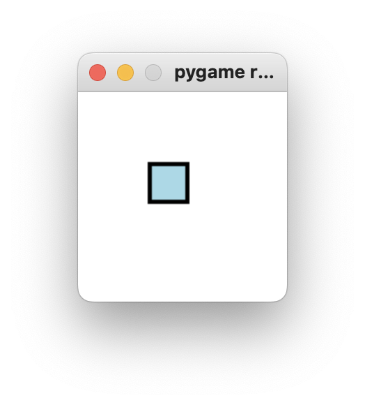

# pygame Rectangle Tutorial

This tutorial will walk you through the creation of a light blue rectangle with a 3 pixel wide black border using pygame. This is intended to address prerequisite knowledge for the Tetris project Assignment 1.

## Finished Product

The final code is given in pygame_rectangle.py, but if you have never used pygame please create your own version by following this tutorial.

### 1. Set Up
Create a new python script. Import `sys`, `pygame`, define a function and create the code for the Name Main Idiom. You may need to add the pygame package to your environment using pip or your IDE.
```python
import sys
import pygame


def pygame_rectangle():
    pass


if __name__ == "__main__":
    pygame_rectangle()
```

### 2. Initialize Pygame and Set Up the Window

The `pygame.init` function initializes all imported pygame modules.

We can call `pygame.display.set_mode` to create a window. We pass the width and height of the window as a tuple. We will save the return value in a local variable to use to draw in the window.

We can set the title of the window using the `pygame.display.set_caption`. Our function now looks like the following code block.

```python
def pygame_rectangle():
    # Initialize pygame
    pygame.init()

    # Set up the drawing window 150x150 pixels
    window_size = (150, 150)
    surface = pygame.display.set_mode(window_size)

    # Set the title (caption) of the window
    title = "pygame rectangle"
    pygame.display.set_caption(title)
```

### 3. Create the Rectangle
We will create the rectangle but we will not draw it until later in our program. We are going to create a tuple to hold the top left corner of the rectangle, a tuple for the size of the rectangle and variables to hold the fill and border colors. Finally we will create a pygame Rect object.
```python
    # Create a rect
    point = (50, 50)    # top left corner of rectangle
    size = (30, 30)     # width and height of rectangle
    fill_color = "lightblue"
    border_color = "black"
    border_width = 3
    rectangle = pygame.Rect(point, size)
```

### 4. pygame Event Loop
pygame, and in fact most graphic libraries, rely on a main loop that processes events. Each time through the loop we will redraw the window. By doing this quickly we can create animations just like we can do using pencil and paper with a flipbook.

In this program the only event we will worry about is the `pygame.QUIT` event. The `QUIT` event is generated with the window is closed or the system stops the program.

In response to the event we will close the window, call `pygame.quit` and the use `sys.exit` to end the program. The `pygame.quit` function does the opposite of the `pygame.init` function shutting down pygame.
```python
    # event loop for program
    while True:
        for event in pygame.event.get():
            if event.type == pygame.QUIT:
                pygame.display.quit()
                pygame.quit()
                sys.exit()
```

### 5. Drawing 
We are ready to draw. Be careful with the indentation on these statements, we want to be inside the `while` loop but outside the `for` loop. Align the code with the `for` statement.
#### a. Clear the Window
`surface` is the return value we stored when we called `pygame.display.set_mode`. It is a `pygame.Surface` so we have functions we can call to draw. `Surface.fill` allows us to fill the entire surface with a color, this effectively clears the surface like shaking an etch-a-sketch upside down.

#### b. Draw the Filled Rectangle
To draw the filled rectangle we will use `pygame.draw.rect`. Note that this time rect is a function and lowercase and not the camelCase class `Rect`. We will pass in three parameters, the `surface`, the fill color and the Rect we created earlier which defines the size and position.

#### c. Draw the Border
The border is also drawn using `pygame.draw.rect`. We will use the border color and add the border width parameter to draw just the border without the fill.

#### d. Flip the Surface
Flipping the surface updates the window, this is like flipping the page in a flipbook. We use the `pygame.display.flip` function which doesn't require parameters.

## Final Thoughts
If you followed along with this tutorial you may have realized we aren't drawing the rectangle a single time, we are drawing it over and over until we quit the program.

Congratulations! You should be ready to attempt Assignment 1 of the Tetris Project.